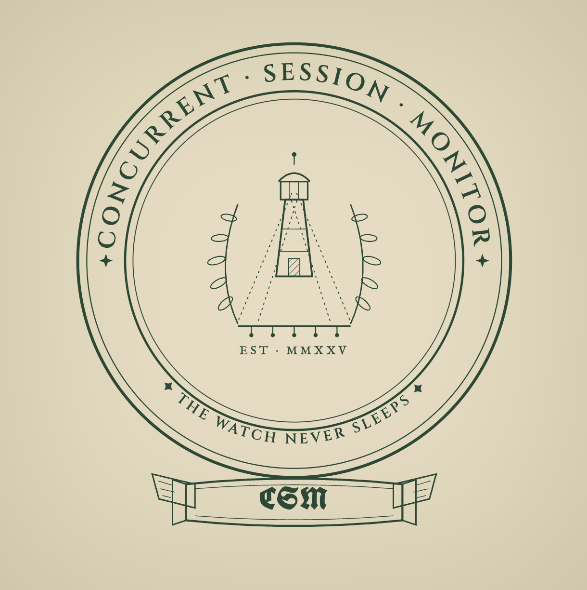
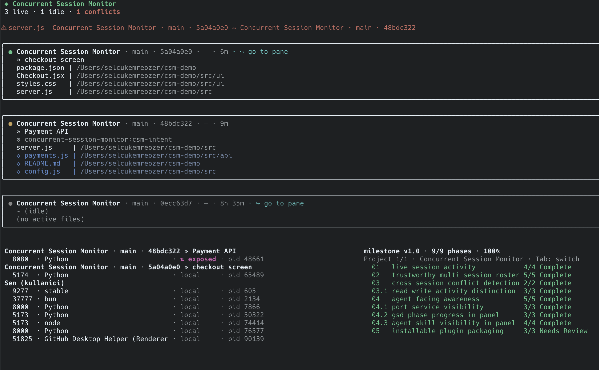

<p align="center">
  
</p>

<h1 align="center">Concurrent Session Monitor</h1>

<p align="center"><em>The watch never sleeps.</em></p>

<p align="center">
  
  
  
  
  
</p>

A Claude Code plugin that gives you real-time visibility into multiple parallel
Claude Code sessions. Hooks silently record which files each session is touching,
slash commands let a session annotate what it is working on, and a live terminal
panel shows, across every running session, active files, current activity,
conflict warnings, and per-session metadata (uptime, model, port and GSD-phase
context). Built for a developer who runs several sessions at once and keeps
hitting file conflicts: when sessions run in parallel, everyone can see **who is
touching which files and what work is being done**, so overlapping edits are
noticed before they collide.

<p align="center">
  
</p>

## Highlights

- **Live file map**: every file each session is touching, updated within about a second, with no manual refresh.
- **Conflict warnings**: the instant two sessions claim the same file, the panel flags it, before the edits collide.
- **Session context**: per-session uptime, model, current intent, listening ports, and GSD-phase progress at a glance.
- **Branch awareness**: each session's live current branch, plus the target branch it declares with `/csm-branch`; the panel flags a mismatch when a session is not yet on the branch it means to work on.
- **Needs-you markers**: a session that asked you a question (Claude's `AskUserQuestion` tool) shows a magenta `◉ asking`; a session blocked on a permission prompt, or sitting idle for `CSM_IDLE_WAIT_MS` (10 s) after its turn ended, shows a yellow `◉ waiting`. The panel header counts both, and `/csm-status` shows the same markers. A marker clears only when the session itself moves on. `asking` clears when you answer the question, the turn ends, or you submit a prompt. `waiting` clears when the main session finishes its next tool; for a permission prompt that is the approved tool, so a long-running approved command keeps the marker up while it runs. It also clears when the turn ends or you submit a prompt. Activity from subagents or parallel agents never clears a marker, so a session blocked on you stays flagged while its other agents keep working; for a prompt raised inside a subagent, the marker therefore stays until the main session itself moves on. Claude Code fires no hook when you approve or deny a permission, reject a question, or press Esc, so after Esc or a rejection the marker stays until your next prompt or the `CSM_ATTN_WINDOW_MS` ceiling. A session with a marker up stays on the roster even when it has been quiet longer than `CSM_STALE_MS`. The question is captured by an async `PreToolUse` hook on `AskUserQuestion`; waiting comes from the `Notification` hook.
- **Running state**: a session that is working a turn (thinking, a long Bash command, a web fetch, even with no file reads or writes) shows a green card border and a green `▶ running` line, the compact row gets a leading green `▶`, and `/csm-status` shows ` ▶ running`. It starts when you submit a prompt and ends when the main session's turn ends (the `Stop` hook); a subagent finishing does not end it. The needs-you markers win (asking, then waiting, then running). A running session keeps a green dot and stays on the roster even when it has been quiet longer than `CSM_STALE_MS`, bounded by `CSM_RUN_WINDOW_MS`. Claude Code fires no `Stop` hook when you interrupt a turn with Esc, so after Esc the session keeps showing `running` until your next prompt, the next turn end, or the `CSM_RUN_WINDOW_MS` ceiling.
- **Zero-config and non-intrusive**: capture hooks are async and never slow your tools; there is nothing to configure.

## Install

Install directly from the git repository in two steps, run inside Claude Code:

1. Add this repo as a plugin marketplace:

   ```
   /plugin marketplace add https://github.com/selcukemreozer/Concurrent-Session-Monitor
   ```

2. Install the plugin. Use the **qualified** name; `@concurrent-session-monitor`
   names the marketplace and disambiguates the install:

   ```
   /plugin install concurrent-session-monitor@concurrent-session-monitor
   ```

That's it. No build step. The panel ships as a committed, self-contained bundle,
and the file-touch hooks start capturing automatically once the plugin is enabled.

## Enable the global `csm` command

Run this once inside Claude Code:

```
/csm-setup
```

It symlinks a global `csm` command into `~/.local/bin` (idempotent and
non-clobbering: it never overwrites an existing file or a symlink it did not
create). If `~/.local/bin` is not on your `PATH`, the command tells you exactly
what line to add to your shell profile.

## Launch the panel

Open a **separate terminal** (not the one running Claude Code) and run the bare
command:

```
csm
```

This opens a live, full-screen panel that redraws as sessions come and go. Press
`Ctrl+C` to exit cleanly; it restores your terminal and leaves no residue.

Keep the panel running in its own terminal while you work in one or more Claude
Code sessions elsewhere.

## Slash commands

Use these from inside any Claude Code session:

- `/csm-intent <task>`: record what this session is working on (shows up on the
  session's row in the panel and in `/csm-status`).
- `/csm-branch <name>`: declare the git branch this session means to work on. The
  panel and `/csm-status` show this target branch next to the session's live
  current branch and flag it when the two differ, so you notice a session still
  sitting on the wrong branch.
- `/csm-done`: mark the current task done, which clears this session's intent and
  its declared target branch, and releases the files it was holding. It does
  **not** end the session.
- `/csm-status`: print the live cross-session roster plus any conflicts relevant
  to you, as plain text, right in the conversation.
- `/csm-goto <folder | session-id>`: bring another live session's terminal pane
  to the front, the in-chat version of the panel's go-to-pane link. It matches
  an exact session id, then an id prefix, then an exact folder name, then a
  folder-name substring (case-insensitive). When several sessions match it
  focuses nothing and lists them so you can pick by id; in a folder shared with
  your own session, it picks the other one. Run it with no argument to list the
  live sessions. **Warp only**: it opens the Warp focus URL recorded when the
  session started, so sessions in other terminals are reported as not
  focusable. It only focuses the pane; nothing is typed or sent into that
  session.

## Configuration

Everything works with zero configuration. For tuning, the panel and hooks read
these environment variables. Each is optional; an unset or invalid value falls
back to the default. Times are in milliseconds.

| Variable | Default | Meaning |
|----------|---------|---------|
| `CSM_STORE_DIR` | `~/.claude/csm` | Root directory for the per-session state shards. Override to relocate the shared store (writers and the panel must agree). |
| `CSM_WINDOW_MS` | `300000` (5 min) | Rolling window for a session's "active files": files touched within this window count as currently held. |
| `CSM_READ_WINDOW_MS` | `30000` (30 s) | Shorter window for read activity; reads decay ~10x faster than writes. |
| `CSM_SKILL_WINDOW_MS` | `300000` (5 min) | Window for the most-recently-invoked skill shown on a session row. |
| `CSM_ATTN_WINDOW_MS` | `1800000` (30 min) | Safety-net ceiling on how long a session's "asking" and "waiting on you" flags can stay shown (after the question was asked or its last Notification) when the session never moves on. Normally "asking" clears when you answer, the turn ends, or you submit a prompt, and "waiting" clears when the main session finishes its next tool (for a permission, the approved tool), the turn ends, or you submit a prompt. Subagent activity never clears a flag. Esc, a rejected question or a denied permission fire no hook, so the flag stays up until your next prompt or this ceiling; a flagged session is not pruned meanwhile. |
| `CSM_IDLE_WAIT_MS` | `10000` (10 s) | How long a session must sit idle after its turn ended (the main session's `Stop` hook) before it shows `◉ waiting`. Claude Code's own idle notification only fires after about 60 s; this derives the idle wait from the session's turn marker instead. Submitting a prompt clears it. Bounded by `CSM_ATTN_WINDOW_MS`. |
| `CSM_RUN_WINDOW_MS` | `1800000` (30 min) | Safety-net ceiling for the running state: a session shows `▶ running` only while its turn marker says running and the newer of its turn start and its last heartbeat is within this window. It bounds the Esc case (no `Stop` hook fires on an interrupt) and the running-session keepalive. |
| `CSM_STALE_MS` | `120000` (2 min) | Liveness TTL: a session with no heartbeat for this long is treated as inactive. A session with an "asking" or "waiting" flag up is kept visible regardless, bounded by `CSM_ATTN_WINDOW_MS`. A session with a running turn is also kept visible regardless, bounded by `CSM_RUN_WINDOW_MS`. |
| `CSM_ACTIVE_MS` | `30000` (30 s) | Recency threshold for the green/yellow activity dot. A running turn always shows the green dot. |
| `CSM_GRACE_MS` | `1200` (1.2 s) | Grace window: a vanished session is shown dim-grey as "ended" for this long before it is pruned, so you see it die rather than blink out. |
| `CSM_CONFLICT_MS` | tracks `CSM_WINDOW_MS` | Conflict-detection window. Not independently wired in v1; the effective window equals the active-file window (`CSM_WINDOW_MS`). |
| `CSM_PORT_SCAN_MS` | `2500` (2.5 s) | Cadence of the listening-port scan feeding the PORTS pane. |
| `CSM_PHASE_SCAN_MS` | `4000` (4 s) | Cadence of the GSD phase-progress scan feeding the FAZLAR pane. |
| `CSM_BRANCH_SCAN_MS` | `1500` (1.5 s) | Cadence of the live current-branch scan that derives each session's checked-out branch from its working directory. |
| `CSM_GSD_TOOLS` | auto-detected | Absolute path to the `gsd-tools` binary used by the phases pane. Set it to override auto-detection. |

## Platform and caveats

- **macOS is the primary, supported platform.** The panel expects a standard
  terminal emulator. Other Unix-likes may work but are not the target.
- **Jumping to a session (`/csm-goto` and the panel's go-to-pane link) works in
  Warp only.** Warp is the only terminal that gives a session a focus URL. A
  session started in another terminal still shows up everywhere else, but
  cannot be focused.
- **The model shown per session is best-effort.** It comes from the Claude Code
  `SessionStart` hook, which may not always include the model; when it is
  unavailable the panel simply omits it.
- **Live token usage and rate-limit/quota display are not in v1.** Those depend on
  the `statusLine` data source and are deferred to a future (v2) release. The
  panel focuses on file/activity visibility and conflict detection today.
